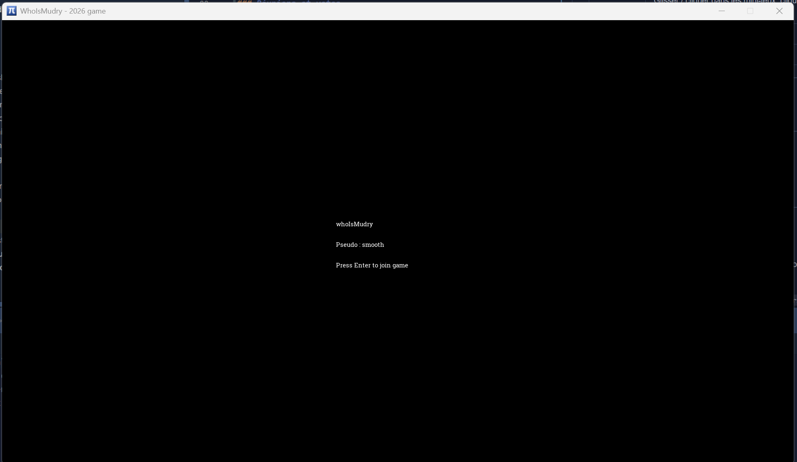
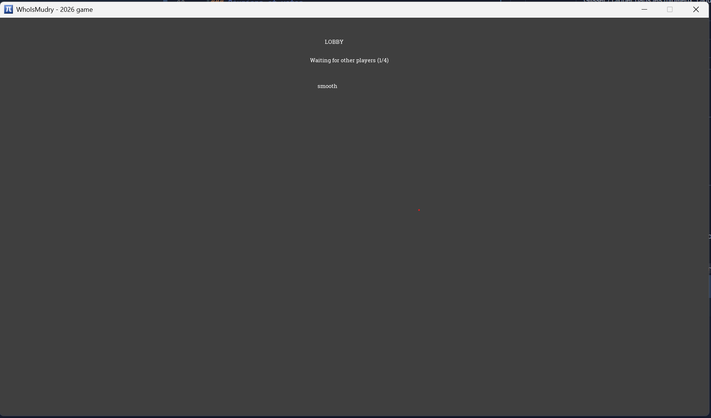
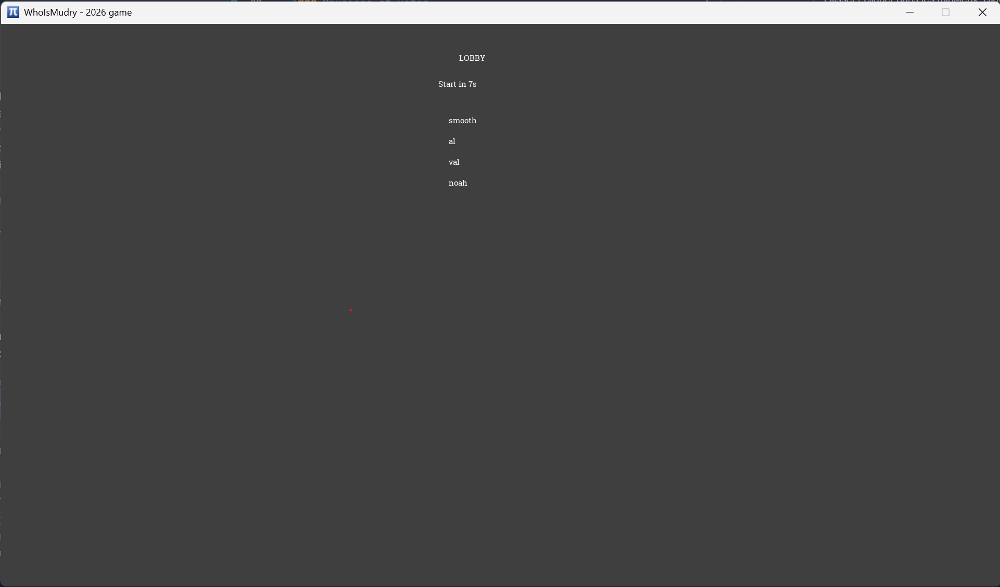
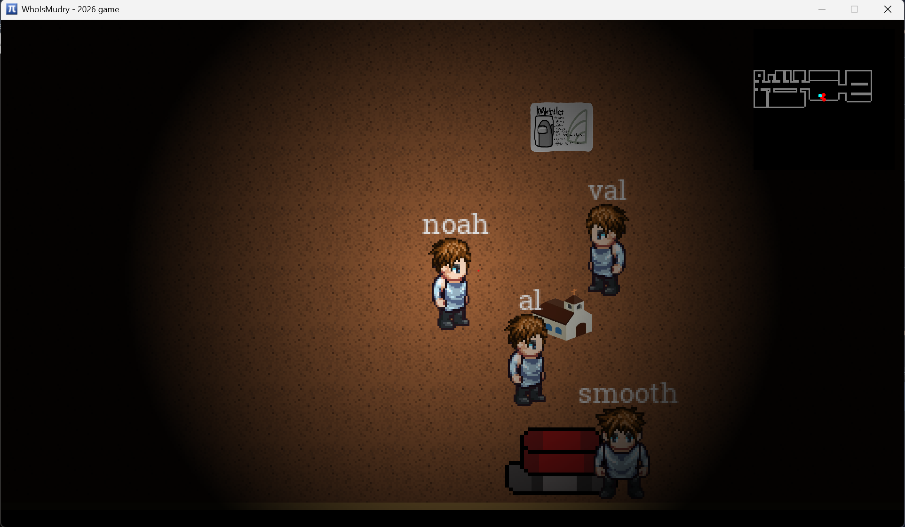
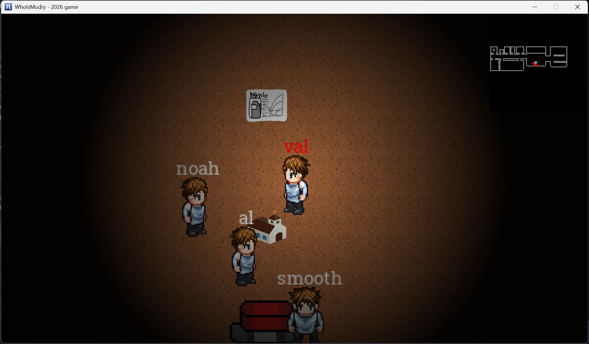
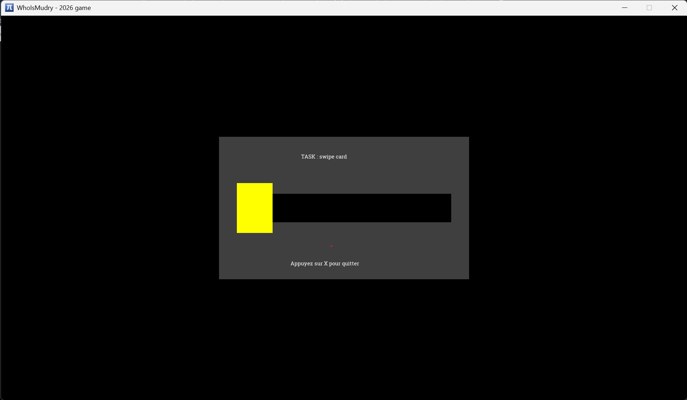
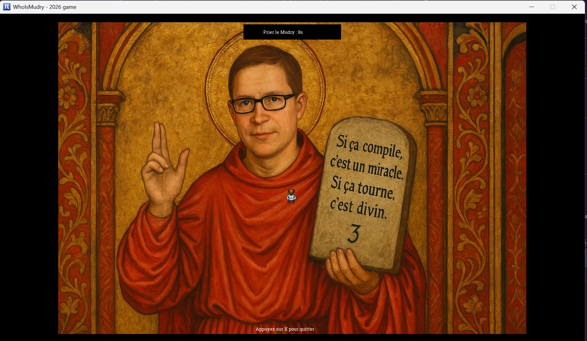
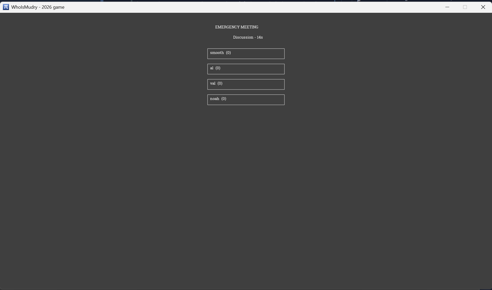
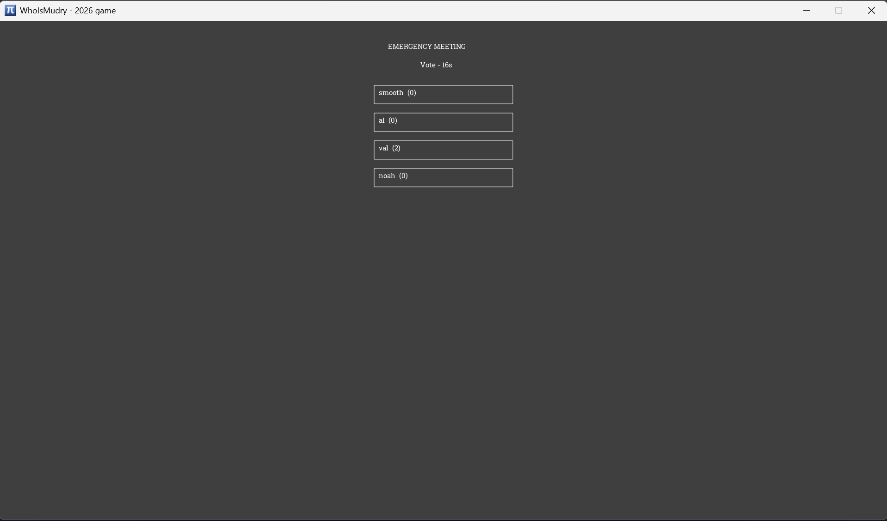
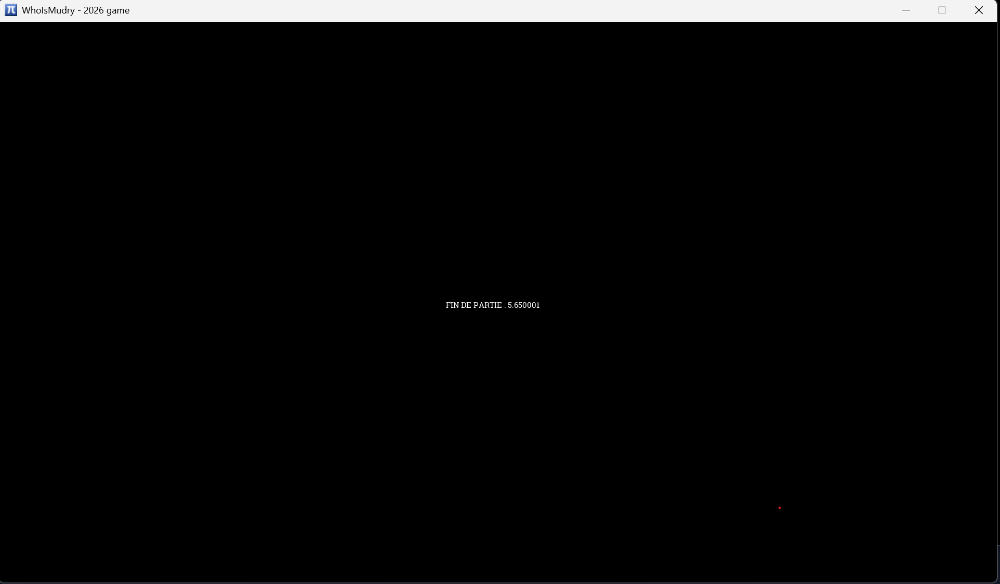

# WhoIsMudry

Un jeu multijoueur de déduction sociale en 2D inspiré d'[Among Us](https://www.innersloth.com/games/among-us/), se déroulant au 3ᵉ étage de la HES-SO Sion, parmi les étudiants de l'ISC et le mystérieux professeur Mudry.

Toutes les spécificités techniques et les détails de l'architecture sont également documentés sur notre [DeepWiki](https://deepwiki.com/Smoother19/whoismudry).

## Sommaire

- [Installation et lancement](#installation-et-lancement)
- [Configuration du serveur](#configuration-du-serveur)
- [Comment jouer](#comment-jouer)
- [Contrôles](#contrôles)
- [Vidéo de démonstration](#vidéo-de-démonstration)
- [Architecture du code](#architecture-du-code)

## Installation et lancement

Ce projet est développé en **Scala** et utilise **sbt** (Scala Build Tool) comme outil de build.

### Prérequis

1. **Cloner le projet** sur votre machine locale.
2. **Configurer le SDK :** ouvrez le projet dans votre IDE (par exemple IntelliJ IDEA) et sélectionnez une version du **JDK 1.8** ou plus récente.
3. **Compilation :** depuis la console `sbt` à la racine du projet, lancez la commande suivante. Elle compile le module partagé et génère automatiquement les classes Scala à partir des fichiers `.proto` (via ScalaPB) :

```bash
shared/compile
```

### Lancer l'application

Une fois la compilation réussie, le jeu se lance en démarrant deux composants distincts (le serveur, qui fait autorité, et le client graphique) :

- **Le serveur :** exécutez `server/src/main/scala/ServerMain.scala`.
- **Le client :** exécutez `client/src/main/scala/app/Main.scala`.

Pour jouer à plusieurs, lancez plusieurs clients (un par joueur) qui se connectent au même serveur.

---

## Configuration du serveur

Par défaut, le client se connecte à notre serveur distant. Pour développer ou jouer en local, il faut changer l'URI de connexion.

Ouvrez `client/src/main/scala/app/GameManager.scala`, dans la méthode `start`, et modifiez l'URI passée au `GameClient` :

- **Serveur distant :** laissez l'URI par défaut.
- **Serveur local (localhost) :** remplacez-la par

```scala
"ws://localhost:8080"
```

Le serveur écoute par défaut sur le port `8080`.

---

## Comment jouer

### Le menu et le lobby

Au démarrage, vous saisissez un pseudo, puis vous validez avec **Entrée**.

<p align="center"></p>

Vous êtes ensuite placé dans un salon d'attente (Lobby), où les connexions WebSocket s'établissent et se synchronisent. La partie démarre automatiquement après un décompte une fois le nombre minimum de joueurs atteint.

<table>
<tr>
<td></td>
<td></td>
</tr>
<tr>
<td align="center">En attente d'autres joueurs</td>
<td align="center">Décompte avant le lancement</td>
</tr>
</table>

### Rôles et objectifs

Une fois la partie lancée, les rôles sont attribués secrètement : vous êtes soit un **étudiant de l'ISC**, soit l'imposteur, le **professeur Mudry**.

> [!NOTE]
> - **Les étudiants** parcourent la carte pour accomplir leurs tâches et tentent de démasquer l'imposteur lors des réunions.
> - **Mudry** élimine discrètement les étudiants un par un, sans se faire prendre.

Indice visuel privé : si vous êtes Mudry, votre propre pseudo s'affiche en **rouge** — mais uniquement sur votre écran. Les autres joueurs voient votre nom en blanc, comme les autres.

<table>
<tr>
<td></td>
<td></td>
</tr>
<tr>
<td align="center">Vue d'un étudiant (tous les noms en blanc)</td>
<td align="center">Vue de Mudry (son propre nom en rouge)</td>
</tr>
</table>

### Interactions et tâches

En déplacement libre (`FreeRoam`), le client évalue en permanence la distance entre votre personnage et les éléments interactifs de la carte.

> [!TIP]
> Une interaction n'est possible que si vous vous trouvez dans le rayon défini par `GameplayConfig.InteractionRadius`. Approchez-vous puis appuyez sur **E**.

À proximité d'une tâche, vous basculez en mode `DoingTask` pour résoudre un mini-jeu (créé par la `TaskFactory`) :

- **CardSwipe** (AdminCard) : faites glisser la carte d'un bout à l'autre du lecteur.
- **PrierMudry** : patientez quelques secondes devant le Saint-Mudry.
- **Question** : répondez correctement à la question posée par le terminal.

<table>
<tr>
<td></td>
<td></td>
</tr>
<tr>
<td align="center">CardSwipe : glisser la carte</td>
<td align="center">PrierMudry : prier le Saint-Mudry</td>
</tr>
</table>

Si vous êtes Mudry, l'interaction (E) à proximité d'un étudiant déclenche une élimination (soumise au cooldown et à la distance, validés par le serveur).

### Réunions et votes

Lorsqu'un joueur appuie sur le bouton d'urgence au centre de la carte, la partie bascule en réunion (`MeetingRenderer`). Une phase de discussion précède la phase de vote. Les survivants votent (`SubmitVote`) pour exclure le suspect : le joueur le plus voté est éjecté.

<table>
<tr>
<td></td>
<td></td>
</tr>
<tr>
<td align="center">Phase de discussion</td>
<td align="center">Phase de vote (les voix s'affichent en direct)</td>
</tr>
</table>

La partie reprend ensuite, ou se termine si une condition de victoire est atteinte. L'écran de fin affiche le résultat avant un redémarrage automatique vers le lobby.

<p align="center"></p>

---

## Contrôles

| Touche | Action |
|---|---|
| **W / A / S / D** | Se déplacer (haut / gauche / bas / droite) |
| **E** | Interagir : ouvrir une tâche, déclencher une réunion, ou éliminer (si Mudry) |
| **Souris** | Glisser / cliquer dans les mini-jeux, cliquer pour voter en réunion |
| **X** | Quitter un mini-jeu en cours |
| **Entrée** | Valider le pseudo dans le menu |

---

## Vidéo de démonstration

La vidéo de démonstration (1080p, 60 Hz, moins de 15 s) se trouve dans le dépôt : [`video/Video_Prog_WhoIsMudry.mp4`](./video/Video_Prog_WhoIsMudry.mp4).

> [!TIP]
> Pour qu'elle se lise directement dans le README sur GitHub, ouvrez le README dans l'éditeur web de GitHub et glissez-déposez le fichier vidéo dans le texte : GitHub génère alors un lecteur intégré.

---

## Architecture du code

Le projet est découpé en trois modules sbt afin d'isoler proprement les responsabilités :

- **`shared`** : les modèles de domaine (`World`, `PlayerState`, `GamePhase`, `Role`…), la détection de collisions, les schémas Protobuf (ScalaPB) et les mappers de conversion modèle ↔ réseau.
- **`server`** : la simulation autoritaire de l'état du monde via **Pekko Actors** (`GameActor`) et la passerelle réseau **WebSocket**.
- **`client`** : le cycle de rendu 2D avec **gdx2d** (basé sur libGDX), la capture des entrées clavier/souris et la gestion de l'état local (`LocalStateManager`).

Le réseau suit un modèle **commande / snapshot** : le client envoie ses intentions (par ex. `UpdateInput`, `KillPlayer`) et le serveur diffuse régulièrement l'état global à jour (`WorldSnapshot`). Le serveur étant autoritaire, c'est lui qui valide toutes les actions, ce qui garantit la cohérence entre les joueurs.

Pour le détail complet de l'architecture, voir le [DeepWiki](https://deepwiki.com/Smoother19/whoismudry).
